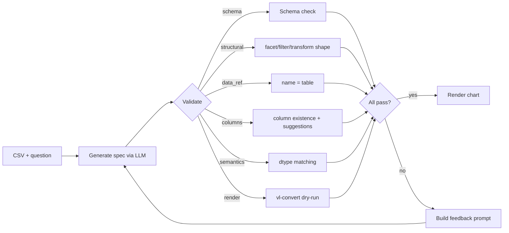

# chart-llm

[](https://github.com/utkarshgogna1/chart-llm/actions/workflows/ci.yml)

Natural-language → Vega-Lite chart generation with a structured validation loop. Benchmarked across Llama-3-70B (Groq) and Llama-3.1-8B (local) on 23 hand-curated queries.

---

## The problem

LLMs produce Vega-Lite chart specs that render but are silently wrong — invented column names, filters in the wrong place, the data block referencing the wrong key. The chart still draws; the user never knows.

---

## What this does

A five-stage validation pipeline checks every generated spec before rendering. On failure, structured errors are fed back to the model as a retry prompt. The loop runs up to N attempts. Failures and timings are recorded.

**Validation stages:**

| Stage | What it catches |
|---|---|
| Schema | Vega-Lite v5 JSON schema violations |
| Structural | `facet`/`row`/`column` nested inside `encoding`; filters at top level |
| Data ref | `data.name` must equal `"table"` |
| Columns | Hallucinated field names (with derived-field exclusion for `calculate`/`window`/`joinaggregate`) |
| Semantics | Quantitative aggregate on a string column; temporal type on a non-date column |
| Render | `vl-convert` dry-run — catches specs that pass the schema but fail at render time |

---

## Demo


---

## Headline benchmark results

| Model | Mode | Validated | Correctness | No Hallucinations | Renders | Median Latency | Avg Attempts |
|---|---|---|---|---|---|---|---|
| llama-70b-groq | baseline | 0% | 77% | 100% | 100% | 568 ms | 1.00 |
| llama-70b-groq | validated | 78% | 68% | 100% | 78% | 589 ms | 1.52 |
| llama-8b-local | baseline | 0% | 27% | 83% | 91% | 6213 ms | 0.91 |
| llama-8b-local | validated | 39% | 23% | 100% | 39% | 16396 ms | 2.26 |

**Validation Impact:**

| Model | Validated Δ | Correctness Δ | No Hallucinations Δ | Renders Δ |
|---|---|---|---|---|
| llama-70b-groq | ↑78% | ↓9% | 0% | ↓22% |
| llama-8b-local | ↑39% | ↓5% | ↑17% | ↓52% |

---

## Architecture



---

## Quickstart

```bash
# Install dependencies
uv sync

# Copy env and add keys
cp .env.example .env
# Edit .env: set GROQ_API_KEY (free at console.groq.com)

# Download Vega-Lite v5 JSON schema
uv run chart-llm fetch-schema

# Run the Streamlit UI
uv run streamlit run app.py
```

For local Llama: install [Ollama](https://ollama.com) and run `ollama pull llama3.1:8b` before starting.

---

## What the benchmark says

The validation loop acts as **contract enforcement**, not model improvement. On the 70B, spec validity rises from 0% to 78% at essentially zero latency cost (568→589 ms); the loop guarantees the downstream renderer gets the exact data-ref and structural shape it expects. Correctness fell slightly (77%→68%) — the loop is not free, and forced retries sometimes produce a valid-but-wrong spec.

On the 8B, the loop cannot compensate for a capability ceiling. Correctness stayed flat (27%→23%), latency rose 2.6×, and most queries hit max-attempts without ever producing a valid spec. The hallucination prevention win (+17 points) is real but insufficient to justify the cost at this model size.

The "no-answer" probe (`movies_007` — asking for directors when the dataset has no director column) worked: both models produced proxy charts in baseline; the validation loop blocked both in validated mode.

Three scoring bugs were caught and fixed mid-run — faceted-spec detection, count-form equivalence, and derived-field hallucination false-positives — each of which moved real numbers. An LLM benchmark is only as honest as its scorer. See [FINDINGS.md](FINDINGS.md) for the full honest account.

---

## Tech

Python 3.11+ · uv · pydantic · httpx · vl-convert · Vega-Lite · altair · streamlit · pytest · ruff

~5000 lines of Python. 192 tests. 0 external paid services required (Groq free tier is sufficient).

---

## What's NOT in scope

- "Visualization quality" judgment (sort order, color choices, axis labels)
- Top-N correctness validation (would require rendering and counting rows)
- Streaming responses
- Multi-turn conversational chart refinement

---

## Links

- [Full benchmark report](benchmarks/results/FULL_REPORT.md)
- [Findings (long-form, honest)](FINDINGS.md)
- [Deploy to Streamlit Cloud](DEPLOY.md)
- [Contributing](CONTRIBUTING.md)
- License: MIT

---

## Reproducibility

```bash
uv sync --extra dev
uv run pytest tests/ -v          # 192/192 should pass

uv run chart-llm bench run \
  --models llama-70b-groq,llama-8b-local \
  --modes baseline,validated \
  --output benchmarks/results/full.jsonl

uv run chart-llm bench report \
  --input benchmarks/results/full.jsonl \
  --output benchmarks/results/FULL_REPORT.md
```

**Requires:** `GROQ_API_KEY` (free tier, [console.groq.com](https://console.groq.com)); Ollama with `llama3.1:8b` pulled for the local model (optional). `GEMINI_API_KEY` reserved for future use.
